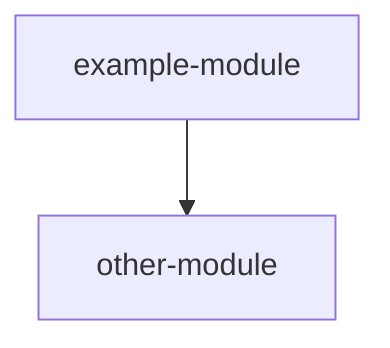

---
paths:
  - src/**
verified: 0000000
verified_date: 2026-01-01
verified_by: claude-model-id (effort)
target_set: (none)
---

<!-- Frontmatter contract — parsed by scripts; keep it EXACTLY this shape:
     paths: globs covering the code the LIVE diagram describes — normally the union of
       the atlas cards' paths (or the top-level source dirs). NEVER a bare '**': commits
       to .claude/memory/ (journaling!) would keep the diagram perpetually "stale".
       Git-pathspec rules apply: no {a,b} braces, no inline # comments.
     verified: short git SHA the LIVE diagram was last checked against. Applies to Live
       ONLY — the Target never goes stale by commit; it changes only by explicit decision.
     verified_by: exact model id (+ effort if known) that re-derived the Live diagram —
       updated together with verified/verified_date, never separately.
     target_set: date the Target was last set/revised, or (none). -->

# Architecture overview

Maintained by `/mem-arch` (bootstrapped by `/mem-init`). **Live** = what the code IS,
verified like an atlas card. **Target** = what it SHOULD become, set by decision.
**Gaps** = the difference, kept explicit so drift is a choice, not an accident.

## Live — what the code is

<!-- Mermaid flowchart at module granularity: nodes ≈ atlas cards, node IDs = card
     names (the diagram doubles as a visual index of the atlas). Edges = runtime or
     dependency relations; label an edge only when its nature isn't obvious. -->

## Target — what it should become

> **Not set.** Run `/mem-arch target` to record the idealized architecture.

<!-- Same visual grammar and node IDs as Live wherever concepts coincide — the
     eyeball-diff between the two diagrams is the point. Nodes and edges that exist
     only here ARE the roadmap. Below the diagram: 2–5 one-line "why this shape"
     bullets; a significant direction change gets an ADR, linked here. -->

## Gaps — live vs target

<!-- Regenerated by /mem-arch whenever either diagram changes. One dated bullet per
     structural difference: what differs — why it matters — where it's tracked. -->

- *(target not set)*

<!-- Budget: ≤120 lines total; trim prose before nodes. Edit in place. After
     re-verifying the whole Live diagram against code, bump verified/verified_date/
     verified_by; after revising Target, bump target_set. -->
